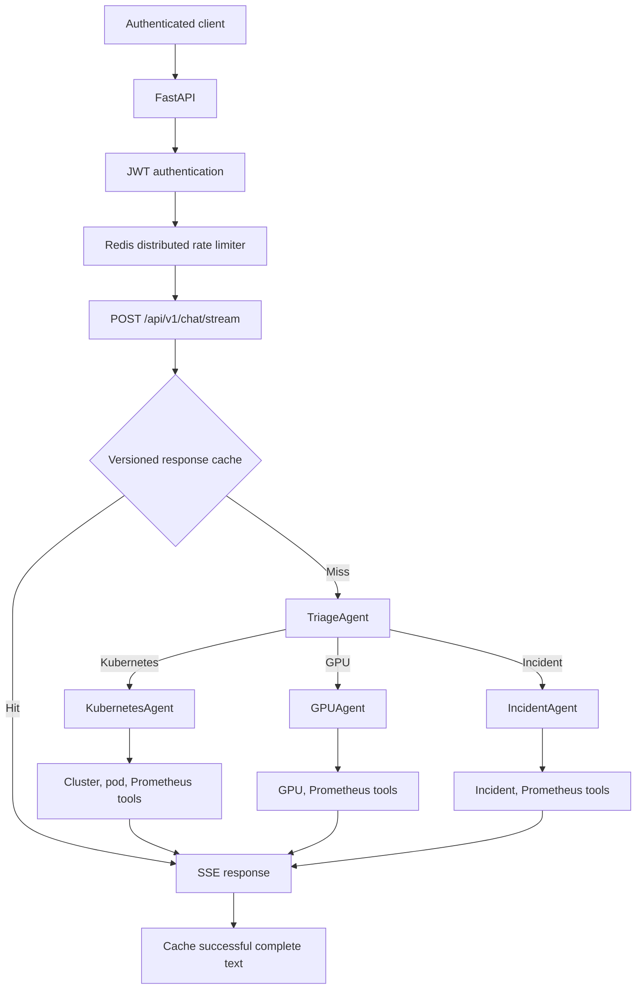
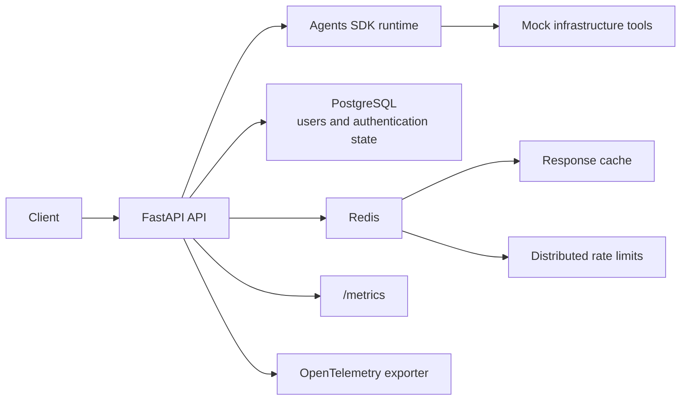

# AI Infrastructure Agent Platform

A production-shaped infrastructure operations API built with FastAPI, the OpenAI Agents SDK,
PostgreSQL, Redis, Server-Sent Events (SSE), Prometheus, OpenTelemetry, Docker Compose, and
Kubernetes.

The service accepts authenticated infrastructure questions, routes them through a triage agent,
hands clearly scoped work to a Kubernetes, GPU, or incident specialist, calls deterministic mock
tools, and streams workflow events plus the final answer to the client.

> **Maturity:** The application and deployment paths are fully runnable and tested as a reference
> platform. The infrastructure tools intentionally return mock, read-only data. It is not ready to
> control real production systems until the authorization, tenant, secret-management, network, and
> audit controls in [Production Risks](docs/PRODUCTION_RISKS.md) are implemented.

## Why this project exists

Infrastructure teams need an agent runtime that is observable, authenticated, horizontally
scalable, and explicit about failure behavior. This repository demonstrates that platform layer:

- JWT-protected FastAPI endpoints and PostgreSQL-backed users.
- A `TriageAgent` that hands off to `KubernetesAgent`, `GPUAgent`, or `IncidentAgent`.
- Read-only mock tools for cluster health, pod failures, GPU utilization, Prometheus metrics, and
  incident history.
- Live SSE events for agent changes, handoffs, tool calls, text deltas, completion, and errors.
- Redis-backed response caching and distributed fixed-window rate limiting.
- Agent turn and wall-clock execution bounds.
- Prometheus metrics, OpenTelemetry spans, and Agents SDK tracing.
- Reproducible Docker Compose and Kubernetes deployment assets.
- Automated unit/contract tests plus CI/CD workflows.

## Technology stack

| Layer | Technology |
|---|---|
| API | Python, FastAPI, Uvicorn, Pydantic |
| AI runtime | OpenAI SDK 3.2.0, OpenAI Agents SDK 0.21.1, Responses API |
| Agent patterns | Agents, handoffs, function tools, input/output guardrails, streaming, tracing |
| Authentication | OAuth2 password form, JWT/HS256, Argon2 password hashing |
| Persistence | PostgreSQL 16, SQLAlchemy async, asyncpg, Alembic |
| Cache and limits | Redis 7, async Redis client, Lua fixed-window limiter |
| Observability | Prometheus client, OpenTelemetry OTLP/HTTP, Agents SDK traces |
| Delivery | Docker, Docker Compose, Kubernetes/Kustomize, GitHub Actions, GHCR |

## Architecture

### Request path



### Supporting services



Detailed design and module interactions are in [Architecture](docs/ARCHITECTURE.md).

## Complete agent execution example

For the request `Why are my Kubernetes pods failing?`:

1. FastAPI validates the request body and authenticates the bearer JWT.
2. The Redis limiter increments the authenticated user's chat counter.
3. The chat route builds a cache key from workflow version, model identity, user ID, and prompt.
4. On a miss, `classify_request()` produces the Kubernetes routing hint.
5. `TriageAgent` invokes the `route_to_kubernetes_agent` handoff.
6. `KubernetesAgent` calls `get_pod_failures()` before making an operational claim.
7. The API emits `agent`, `handoff`, `tool`, and `delta` SSE events in real time.
8. The complete successful text is written to Redis with its TTL.
9. The API emits `done` with `cached: false`.
10. The next identical request for the same user replays the exact cached text and emits
    `cached: true`.

Input and output guardrail failures, provider errors, and timeouts emit safe `error` events and are
not cached. See [Agent Flow](docs/AGENT_FLOW.md) for event payloads and failure semantics.

## Core components

| Component | Responsibility |
|---|---|
| `platform_app/main.py` | Creates FastAPI, installs CORS, mounts routes and metrics, and configures telemetry. |
| `platform_app/routes/auth.py` | Registration, login/token issuance, current-user endpoint, and IP-scoped auth rate limits. |
| `platform_app/routes/chat.py` | Authenticated chat endpoint, cache policy, SSE adapter, safe error handling, and per-user rate limit. |
| `platform_app/agent.py` | Agents, handoffs, tools, guardrails, routing hint, tracing, execution bounds, and normalized stream events. |
| `platform_app/rate_limit.py` | Atomic Redis fixed-window counter and 429 responses. Redis errors currently fail open and are documented as a risk. |
| `platform_app/auth.py` | Argon2 password operations, JWT creation/validation, and active-user lookup. |
| `platform_app/db.py` / `models.py` | Async SQLAlchemy engine/session and persisted user model. |
| `platform_app/cache.py` | Shared async Redis client, readiness ping, and shutdown. |
| `platform_app/metrics.py` | Prometheus counters and latency histogram. |
| `platform_app/telemetry.py` | FastAPI instrumentation and optional OTLP trace export. |
| `migrations/` | Alembic environment and initial users-table migration. |
| `tests/` | API, routing, handoff, tool, guardrail, cache, timeout, and limiter tests. |
| `k8s/` | Namespace, ConfigMap, Secret example, API, PostgreSQL, Redis, HPA, and Kustomize base. |

## Production Hardening

### Distributed rate limiting

`platform_app/rate_limit.py` uses one atomic Redis Lua operation to increment a fixed-window key and
set its expiry. The limiter protects:

- Registration by client IP.
- Login/token issuance by client IP.
- Chat by authenticated user ID.

The current default is **30 requests per subject per 60 seconds**. Redis is required so every API
replica observes the same counters when the service scales horizontally. A process-local limiter
would allow each replica to grant a separate quota.

Redis errors currently fail open to preserve availability and are logged. Rate-limit rejections are
counted, but backend failures do not yet have a dedicated counter. That tradeoff is an unresolved
security, observability, and cost risk; see [Production Risks](docs/PRODUCTION_RISKS.md).

### Bounded agent execution

Every streamed run is constrained by:

- **Maximum agent turns:** 6
- **Maximum execution duration:** 90 seconds

The turn bound is passed to `Runner.run_streamed()`. The stream is consumed inside
`asyncio.timeout()`. A deadline produces a safe SSE `error` event with code `agent_timeout`, records
the timeout request status, and leaves incomplete text out of the cache.

These controls limit runaway agents, excessive token use, long tool loops, and hung client
connections.

### Cache hardening

Response keys include:

- `CACHE_KEY_VERSION`, which identifies prompt/tool/workflow semantics.
- A hash of `OPENAI_MODEL`.
- The authenticated user ID.
- A SHA-256 hash of the exact prompt.

Cached text is replayed as one exact, whitespace-preserving SSE delta. Redis read/write failures fail
open and are measured without failing the AI request. Empty, incomplete, timed-out, provider-error,
and guardrail-failed responses are not cached.

## Prerequisites

The repository is built and tested in CI and Docker with Python 3.12. Local validation has also used
Python 3.14.

- Python 3.12 or newer.
- Docker Engine and Docker Compose v2+ for the recommended full-stack path.
- Git 2.40+.
- Optional: `kubectl` with Kustomize support for manifest validation/deployment.
- An OpenAI API key for live agent requests.

## Environment configuration

Copy the safe template and replace only local values:

```bash
cp .env.example .env
```

`.env` is ignored by Git and Docker build context. Docker Compose reads it automatically. The Python
settings class intentionally does not auto-load env files, so direct local execution requires the
variables to be exported into the process environment.

| Variable | Required | Default/purpose |
|---|---:|---|
| `APP_NAME` | No | API display name. |
| `ENVIRONMENT` | Yes in deployment | `development`; enables strict secret checks for `production`/`prod`. |
| `PORT` | No | Uvicorn port, default `8000`. |
| `OPENAI_API_KEY` | Live requests | OpenAI credential; never commit it. |
| `OPENAI_MODEL` | No | `gpt-5.2`; included in cache identity. |
| `JWT_SECRET_KEY` | Yes | Unique signing secret; at least 32 random characters in production. |
| `JWT_ALGORITHM` | No | `HS256`. |
| `ACCESS_TOKEN_EXPIRE_MINUTES` | No | JWT lifetime, default `30`. |
| `DATABASE_URL` | Yes | SQLAlchemy async PostgreSQL URL. |
| `DB_POOL_SIZE` | No | Connections retained per API process, default `10`. |
| `DB_MAX_OVERFLOW` | No | Extra burst connections per process, default `20`. |
| `REDIS_URL` | Yes | Redis URL for cache and limiter. |
| `CACHE_TTL_SECONDS` | No | Successful response TTL, default `300`. |
| `CACHE_KEY_VERSION` | No | Workflow/cache schema identifier, default `infra-agents-v2`. |
| `RATE_LIMIT_WINDOW_SECONDS` | No | Fixed window, default `60`. |
| `RATE_LIMIT_REQUESTS` | No | Requests per subject/window, default `30`. |
| `AGENT_MAX_TURNS` | No | Agents SDK turn bound, default `6`. |
| `AGENT_TIMEOUT_SECONDS` | No | Wall-clock run deadline, default `90`. |
| `CORS_ORIGINS` | No | Comma-separated allowed browser origins. |
| `OTEL_SERVICE_NAME` | No | Trace resource service name. |
| `OTEL_EXPORTER_OTLP_ENDPOINT` | No | OTLP/HTTP trace endpoint; no exporter when empty. |

## Run with Docker Compose

The recommended development path starts PostgreSQL, Redis, migrations, and the API:

```bash
docker compose up --build -d
docker compose ps
```

The API listens on `http://localhost:8000`. PostgreSQL and Redis use named Docker volumes and are not
published to host ports.

Stop the stack without deleting data:

```bash
docker compose down
```

To remove Compose volumes as well, use `docker compose down --volumes` only when data deletion is
intentional.

## Run directly with Python

Use this path when PostgreSQL and Redis are already available at `DATABASE_URL` and `REDIS_URL`:

```bash
python3 -m venv .venv
source .venv/bin/activate
python -m pip install --upgrade pip
python -m pip install -r requirements.txt
cp .env.example .env
set -a
source .env
set +a
alembic upgrade head
python main.py
```

## Health and dependency checks

```bash
curl --fail http://localhost:8000/health/live
curl --fail http://localhost:8000/health/ready
curl --fail http://localhost:8000/metrics
docker compose exec -T postgres pg_isready -U platform -d platform
docker compose exec -T redis redis-cli ping
```

Readiness returns HTTP 503 if PostgreSQL or Redis cannot be reached.

## API usage

### Register

```bash
curl -X POST http://localhost:8000/api/v1/auth/register \
  -H 'Content-Type: application/json' \
  -d '{"email":"operator@example.com","password":"replace-this-local-password"}'
```

### Login

```bash
curl -X POST http://localhost:8000/api/v1/auth/token \
  -H 'Content-Type: application/x-www-form-urlencoded' \
  --data-urlencode 'username=operator@example.com' \
  --data-urlencode 'password=replace-this-local-password'
```

Copy the returned `access_token` into the examples below. Never commit tokens.

### Authenticated chat

```bash
curl -N -X POST http://localhost:8000/api/v1/chat/stream \
  -H 'Authorization: Bearer <access-token>' \
  -H 'Content-Type: application/json' \
  -d '{"prompt":"What is happening with production infrastructure?"}'
```

The broad question remains with `TriageAgent`, which should ask one concise clarifying question.

### Kubernetes specialist query

```bash
curl -N -X POST http://localhost:8000/api/v1/chat/stream \
  -H 'Authorization: Bearer <access-token>' \
  -H 'Content-Type: application/json' \
  -d '{"prompt":"Why are my Kubernetes pods failing?"}'
```

The stream exposes the `TriageAgent` to `KubernetesAgent` handoff, the
`get_pod_failures` tool call, text deltas, and completion metadata.

## Testing and validation

Run the development checks from a fresh virtual environment:

```bash
make lint
make test
python -m compileall -q main.py app.py platform_app migrations
docker compose config --quiet
kubectl kustomize k8s >/dev/null
```

Current validation baseline:

- 19 tests passed.
- Ruff passed.
- Python compilation passed.
- Docker Compose configuration passed.
- Kubernetes manifests rendered successfully.
- API, PostgreSQL, and Redis health checks passed.
- JWT registration/login persisted in PostgreSQL.
- `TriageAgent -> KubernetesAgent -> get_pod_failures` streamed successfully.
- Exact Redis cache-hit replay passed.
- PostgreSQL row count and Redis `PONG` were verified.
- No runtime error signatures were found in container logs.

The final repository-preparation run re-verifies these claims. Tests are intentionally excluded from
the production Docker image by `.dockerignore`; the complete suite runs in development and CI.

## Kubernetes and CI/CD

- [Kubernetes deployment guide](docs/KUBERNETES.md)
- [Security model and secret handling](docs/SECURITY.md)
- [Known production risks](docs/PRODUCTION_RISKS.md)
- [Troubleshooting](docs/TROUBLESHOOTING.md)

`.github/workflows/ci.yml` installs dependencies, runs Ruff, compiles Python, and runs tests.
`.github/workflows/cd.yml` builds and publishes a Git-SHA-tagged image to GHCR and deploys the
Kustomize base. Production deployment requires the GitHub environment secret `KUBE_CONFIG_B64`.
Known CI credential and immutable-action gaps are documented rather than hidden.

## Repository structure

```text
.
├── .github/
│   └── workflows/
│       ├── ci.yml
│       └── cd.yml
├── docs/
│   ├── AGENT_FLOW.md
│   ├── ARCHITECTURE.md
│   ├── KUBERNETES.md
│   ├── PRODUCTION_RISKS.md
│   ├── SECURITY.md
│   └── TROUBLESHOOTING.md
├── k8s/
├── migrations/
├── platform_app/
│   └── routes/
├── scripts/
├── tests/
├── .dockerignore
├── .env.example
├── .gitignore
├── Dockerfile
├── Makefile
├── alembic.ini
├── app.py
├── docker-compose.yml
├── main.py
├── pyproject.toml
└── requirements.txt
```

## Security posture

No real API key, JWT secret, private key, kubeconfig, database dump, log, or populated environment
file belongs in this repository. Placeholder examples are intentionally non-secret. Review
[Security](docs/SECURITY.md) before introducing real infrastructure tools or exposing the API beyond
a controlled environment.
