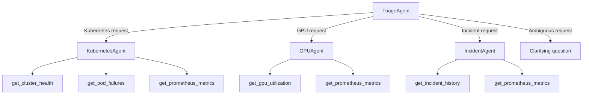
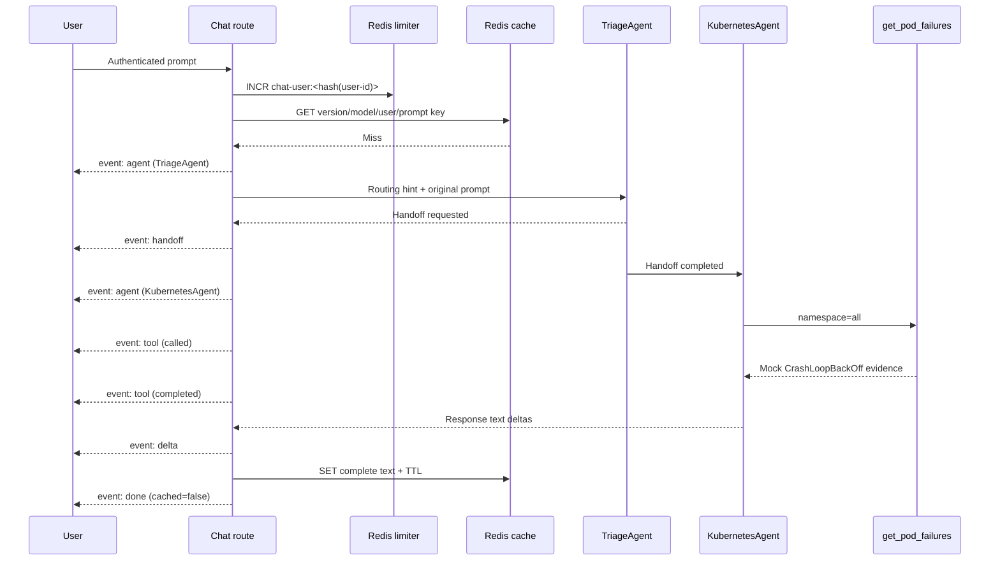

# Agent execution flow

## Agent graph



## Concrete Kubernetes request

User input:

```text
Why are my Kubernetes pods failing?
```

Execution:



## Routing and handoffs

`classify_request()` is deterministic and case-insensitive:

- Kubernetes terms include `kubernetes`, `k8s`, `pod`, `node`, `namespace`, `deployment`,
  `readiness`, `cluster health`, and `workload`.
- GPU terms include `gpu`, `cuda`, `nvidia`, and `accelerator`.
- Incident terms include `incident`, `outage`, `postmortem`, `root cause`, `sev1`, and `sev2`.
- Zero matches or multiple domains produce `ambiguous`.

The result becomes an explicit routing hint in the runtime prompt. `TriageAgent` owns the actual
Agents SDK handoff, producing native handoff events and traces. For ambiguous input, it is instructed
not to guess.

This separation gives tests a stable policy contract while preserving model-driven handoffs. It is
not a hard security boundary: the model still sees all three handoffs, so real tools require
application-enforced routing and authorization.

## Tool invocation

Specialist instructions require a relevant tool before an operational claim:

| Agent | Tools |
|---|---|
| `KubernetesAgent` | `get_cluster_health`, `get_pod_failures`, `get_prometheus_metrics` |
| `GPUAgent` | `get_gpu_utilization`, `get_prometheus_metrics` |
| `IncidentAgent` | `get_incident_history`, `get_prometheus_metrics` |

Each tool:

- Is declared with `@function_tool`.
- Has a typed schema derived from its Python signature.
- Records `ai_agent_tool_calls_total`.
- Returns JSON-encoded mock evidence.
- Performs no mutation, network access, or cluster action.

Tool stream events expose status, agent name, and tool name. Raw arguments and raw tool JSON are not
sent directly to clients; the model summarizes evidence in its final response.

## Guardrails

### Input

`infrastructure_scope_guardrail` runs on `TriageAgent` input. Clearly unrelated input trips before
the triage model runs and becomes a safe SSE error. It is a keyword-based scope filter.

### Output

`operations_output_guardrail` runs on specialist final output and requires infrastructure-related
terms. A tripwire becomes a safe SSE error and is counted.

The output guardrail is evaluated against final output. Since text deltas are streamed before final
completion, it cannot retract text already delivered. Treat it as quality control, not a
confidentiality boundary.

## Streaming events

Example event sequence:

```text
event: agent
data: {"name":"TriageAgent","role":"triage"}

event: handoff
data: {"status":"requested","from_agent":"TriageAgent","to_agent":"KubernetesAgent"}

event: handoff
data: {"status":"completed","from_agent":"TriageAgent","to_agent":"KubernetesAgent"}

event: agent
data: {"name":"KubernetesAgent","role":"specialist"}

event: tool
data: {"status":"called","agent":"KubernetesAgent","name":"get_pod_failures"}

event: tool
data: {"status":"completed","agent":"KubernetesAgent","name":"get_pod_failures"}

event: delta
data: "..."

event: done
data: {"cached":false}
```

Event order reflects the Agents SDK stream. Clients should tolerate repeated agent/tool events and
must treat `done` as the only successful terminal event.

## Cache behavior

Before the agent starts, the route performs a per-user cache lookup. A hit emits one exact `delta`
containing the full cached text, followed by `done` with `cached: true`.

On a miss, text deltas are accumulated only for a possible successful cache write. The route skips
cache writes for:

- Empty output.
- Input or output guardrail trips.
- Timeouts.
- Provider/runtime exceptions.
- Any stream that does not complete normally.

Redis cache errors do not fail the AI response. They increment `ai_cache_errors_total` and are
logged.

## Timeout and failure behavior

| Failure | Client behavior | Cached? | Metric/status |
|---|---|---:|---|
| Input guardrail | Safe `error` with guardrail name | No | guardrail counter + chat `guardrail` |
| Output guardrail | Safe `error` with guardrail name | No | guardrail counter + chat `guardrail` |
| 90-second timeout | Safe `error` with `agent_timeout` | No | chat `timeout` |
| Provider/runtime exception | Generic `error` | No | chat `error`; internal exception log |
| Redis cache read/write error | Continue uncached | No write on failure | cache error counter |
| Redis limiter error | Continue request | N/A | exception log; unresolved risk |
| Rate limit exceeded | HTTP 429 before stream starts | N/A | rate-limit counter |

## Tracing

Each run is enclosed by:

- Agents SDK trace: `infrastructure_operations`.
- OpenTelemetry span: `agents.infrastructure_operations`.

The OpenTelemetry span records entry agent and routing decision. Native Agents SDK traces capture
model activity, handoffs, tool calls, and guardrails. Correlation IDs, provider request IDs, token and
cost metrics, and a durable action audit log are not yet implemented.

## Test coverage

`tests/test_multi_agent.py` uses a deterministic model double to prove:

- Kubernetes questions classify to Kubernetes.
- GPU questions classify to GPU.
- Incident questions classify to incident.
- Broad infrastructure questions remain ambiguous.
- Unrelated requests trip the input guardrail.
- A triage handoff reaches `KubernetesAgent`.
- Each specialist can call its expected tool.

`tests/test_hardening.py` covers the limiter threshold/fail-open behavior, versioned model-aware
cache key, exact cache replay, cache-read failure behavior, and explicit agent timeout.
