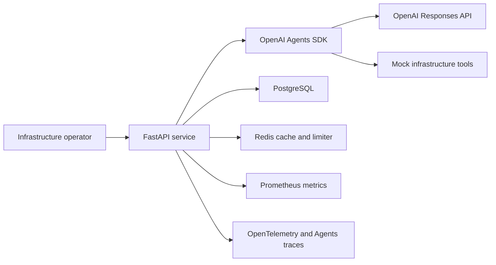
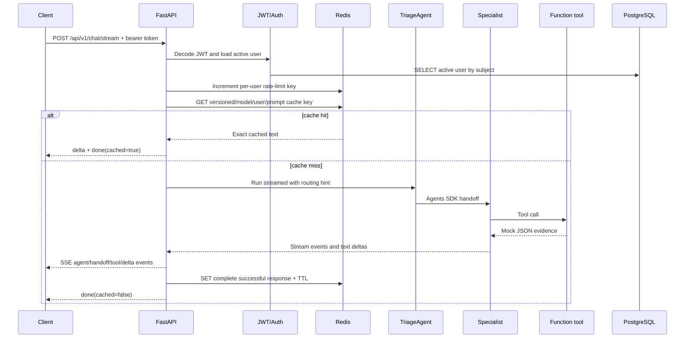

# Architecture

## Scope and maturity

This document describes the implementation in this repository as it exists today. It does not
describe an aspirational control plane. The service is a production-shaped reference platform with
working authentication, persistence, distributed caching and rate limiting, multi-agent routing,
SSE streaming, metrics, tracing, Compose, Kubernetes, and CI/CD. Its infrastructure integrations are
mock, read-only function tools.

## System context



## Request lifecycle



## API layer

`platform_app/main.py` owns application composition:

- Creates the FastAPI app and lifespan handler.
- Installs CORS with configured origins and restricted methods/headers.
- Mounts health, authentication, and chat routers.
- Exposes the Prometheus registry at `/metrics`.
- Installs FastAPI OpenTelemetry instrumentation.
- Closes Redis and SQLAlchemy resources during shutdown.

`main.py` is the executable Uvicorn entry point. `app.py` is a backward-compatible import alias.
The container uses `scripts/start.sh`, which runs Alembic before starting Uvicorn.

## Authentication and persistence

`platform_app/routes/auth.py` exposes:

- `POST /api/v1/auth/register`
- `POST /api/v1/auth/token`
- `GET /api/v1/auth/me`

Registration normalizes email addresses, hashes passwords with `PasswordHash.recommended()`
(Argon2 through `pwdlib`), and persists users with SQLAlchemy. Login uses OAuth2 form fields and
returns an expiring HS256 JWT. `platform_app/auth.py` decodes the token, pins the configured
algorithm, and reloads the active user from PostgreSQL for every protected request.

`platform_app/db.py` creates one async SQLAlchemy engine per process. With current defaults, each API
replica can retain 10 connections and burst to 30. `platform_app/models.py` defines the `users`
table; `migrations/versions/0001_initial.py` creates it and its uniqueness/index controls.

## Redis cache

`platform_app/routes/chat.py` owns cache semantics because caching is part of the HTTP response
contract, not the agent definition.

The key format is:

```text
ai-platform:response:<workflow-version>:<model-hash>:<user-id>:<prompt-hash>
```

Properties:

- User IDs prevent cross-user cache reuse.
- Prompt SHA-256 preserves exact prompt identity without storing prompt text in the key.
- Model identity prevents replay across model changes.
- Workflow version allows explicit invalidation after prompt, handoff, tool, or response changes.
- Cached response text is replayed exactly, including whitespace.
- Redis read/write errors are logged and counted but do not fail the AI request.
- Only nonempty, fully completed, successful responses are written.

## Distributed rate limiter

`platform_app/rate_limit.py` uses a constant Redis Lua script:

1. `INCR` the subject key atomically.
2. Set `EXPIRE` only when the counter is first created.
3. Return the current count.
4. Raise HTTP 429 after the configured threshold.

Subjects are hashed before inclusion in Redis keys. Registration and login use the derived client
address; chat uses the authenticated database user ID. The default is 30 requests per 60 seconds.

The limiter deliberately fails open on `RedisError`. This protects service availability but removes
an abuse/cost boundary during Redis outages. It is documented as unresolved.

## Agents SDK runtime

`platform_app/agent.py` contains the full agent graph:

- `TriageAgent` owns the initial request and exposes three handoffs.
- `KubernetesAgent` exposes cluster health, pod failure, and Prometheus tools.
- `GPUAgent` exposes GPU utilization and Prometheus tools.
- `IncidentAgent` exposes incident history and Prometheus tools.

The deterministic `classify_request()` function produces a stable routing hint. The model still
executes the handoff, which keeps Agents SDK handoff events and tracing visible. Ambiguous requests
are instructed to remain with triage and ask one clarifying question.

The tools use `@function_tool`, have typed arguments, record Prometheus counters, return JSON strings,
and perform no network or infrastructure mutation.

## Guardrails

The input guardrail rejects clearly unrelated prompts before triage. Specialist output guardrails
require operations-related content. Tripwires are translated to safe API errors and counted.

These guardrails are useful scope controls, not authorization boundaries. They use keyword checks,
and final-output guardrails can run after text deltas have already been streamed. Real tools must
enforce user, tenant, role, resource, and side-effect authorization independently.

## Streaming contract

`stream_agent_response()` converts Agents SDK events into stable `AgentStreamEvent` objects. The chat
route serializes them as SSE:

| Event | Purpose |
|---|---|
| `agent` | Announces triage or the active specialist. |
| `handoff` | Reports requested/completed handoff source and target. |
| `tool` | Reports tool called/completed, agent, and tool name. |
| `delta` | Carries a text fragment or exact cached response. |
| `done` | Marks success and reports cache status. |
| `error` | Carries a safe guardrail, timeout, or generic provider error. |

The response disables buffering and HTTP caching so clients can display progress in real time.

## Execution bounds and failures

- `Runner.run_streamed(..., max_turns=6)` limits model/tool/handoff turns.
- `asyncio.timeout(90)` limits stream duration.
- Guardrail and timeout exceptions become safe SSE errors.
- Unexpected exceptions are logged internally and become a generic client error.
- Partial output is not cached.
- Redis cache errors fail open.
- Redis limiter errors fail open.
- Readiness fails closed when PostgreSQL or Redis cannot be reached.

## Observability

Prometheus metrics cover:

- Chat outcomes and latency.
- Cache hits, misses, and handled errors.
- Tool calls and handoffs.
- Guardrail trips.
- Rate-limit rejections.

The Agents SDK trace wraps each infrastructure workflow. An OpenTelemetry span records the entry
agent and deterministic routing decision. FastAPI is instrumented automatically. When
`OTEL_EXPORTER_OTLP_ENDPOINT` is set, spans are exported with a batch processor; otherwise tracing
remains local.

Missing correlation IDs, OpenAI request IDs, structured tool outcomes, token/cost metrics, and a
durable agent-action audit trail are tracked in `PRODUCTION_RISKS.md`.

## Deployment topology

Docker Compose runs one API container plus PostgreSQL and Redis with named volumes. Kubernetes runs
two API replicas, PostgreSQL as a StatefulSet with a PVC, Redis as a Deployment with `emptyDir`, and
an HPA that scales API replicas from 2 to 10 on CPU.

The API pod is non-root, drops Linux capabilities, disables privilege escalation, uses RuntimeDefault
seccomp, and has a read-only root filesystem. Kubernetes production gaps are documented separately.

## Module map

| Path | Interaction and responsibility |
|---|---|
| `platform_app/config.py` | Reads environment variables, provides defaults, validates production key presence/length, and feeds every subsystem. |
| `platform_app/main.py` | Composes FastAPI and lifecycle resources. |
| `platform_app/routes/health.py` | Liveness and concurrent PostgreSQL/Redis readiness. |
| `platform_app/routes/auth.py` | HTTP identity workflow and auth-route throttling. |
| `platform_app/auth.py` | Cryptographic password/JWT operations and active-user dependency. |
| `platform_app/routes/chat.py` | Authenticated streaming orchestration, caching, safe errors, and metrics. |
| `platform_app/agent.py` | Agent graph, tools, guardrails, event normalization, traces, and execution bounds. |
| `platform_app/rate_limit.py` | Shared distributed limiter used by auth and chat routes. |
| `platform_app/cache.py` | Shared Redis connection used by health, chat, and limiter modules. |
| `platform_app/db.py` | Shared async engine and sessions used by auth and health. |
| `platform_app/metrics.py` | Metric definitions imported by routes, tools, and limiter. |
| `platform_app/telemetry.py` | OpenTelemetry provider/exporter and FastAPI instrumentation. |
| `migrations/` | Database schema evolution run at container startup. |
| `scripts/start.sh` | Migration and Uvicorn container entrypoint. |
