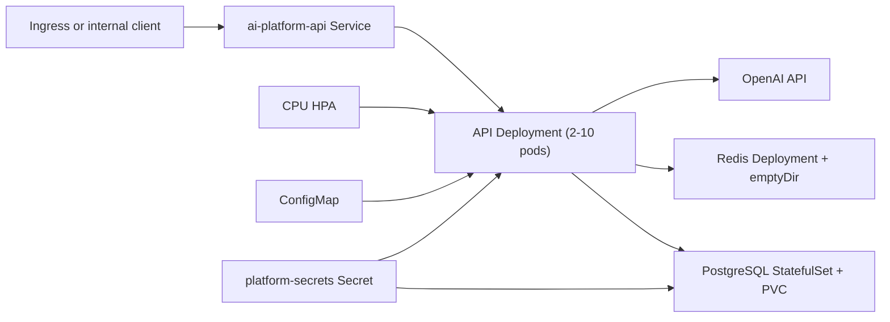

# Kubernetes deployment

The `k8s/` directory is a runnable Kustomize base for the current platform. It is suitable for
development and controlled demonstrations. It is not a complete production cluster design; the
gaps at the end of this document are intentional and tracked.

## Resource model

| Manifest | Resources | Responsibility |
|---|---|---|
| `namespace.yaml` | Namespace `ai-platform` | Isolates the platform's Kubernetes resources. |
| `configmap.yaml` | ConfigMap `platform-config` | Holds non-secret model, cache, rate-limit, execution-bound, and telemetry settings. |
| `secret.example.yaml` | Example Secret | Documents required secret keys; it must never contain real values or be applied unchanged. |
| `api.yaml` | Service, Deployment, HPA | Exposes the FastAPI service internally, runs two API replicas, and scales on CPU. |
| `postgres.yaml` | Service, StatefulSet, PVC template | Runs one PostgreSQL 16 instance with persistent storage. |
| `redis.yaml` | Service, Deployment | Runs one Redis 7 instance for caching and rate limiting. Its current storage is ephemeral. |
| `kustomization.yaml` | Kustomization | Applies the namespace, configuration, data services, API, and autoscaler together. |



No Ingress or external `LoadBalancer` is defined. The API Service is cluster-internal and listens
on port 80, forwarding to container port 8000.

## Configuration and secrets

The ConfigMap sets the current operational defaults:

- model: `gpt-5.2`
- cache workflow version: `infra-agents-v2`
- distributed rate limit: 30 requests per 60 seconds
- maximum agent turns: 6
- maximum agent execution duration: 90 seconds

The `platform-secrets` Secret must provide:

- `OPENAI_API_KEY`
- `JWT_SECRET_KEY`
- `DATABASE_URL`
- `REDIS_URL`
- `POSTGRES_DB`
- `POSTGRES_USER`
- `POSTGRES_PASSWORD`

`k8s/secret.example.yaml` contains placeholders only. Never edit it with real values. For local
experiments, copy it to the Git-ignored `k8s/secret.local.yaml`, replace the placeholders, and apply
that file separately. Production deployments should create the Secret through an external secret
manager or the deployment system, not from a plaintext file in this repository.

## API deployment

The API Deployment starts with two replicas. Each pod:

- runs as a non-root user with the runtime-default seccomp profile;
- disallows privilege escalation and drops all Linux capabilities;
- uses a read-only root filesystem;
- requests 100 millicores and 256 MiB, with limits of one CPU and 1 GiB;
- exposes port 8000;
- reads configuration from `platform-config` and `platform-secrets`;
- uses `/health/ready` for readiness and `/health/live` for liveness.

The container entry point runs `alembic upgrade head` before starting Uvicorn. With multiple API
replicas this means migrations can start concurrently. The current single migration is safe in the
validated environment, but production should run migrations as a separate, serialized deployment
step or Job.

The HPA targets the API Deployment, keeps at least two replicas, allows up to ten, and targets 70%
average CPU utilization. Horizontal API scaling is possible because authentication state is in
PostgreSQL and rate-limit/cache state is in Redis. Database and OpenAI capacity do not automatically
scale with the API and must be budgeted separately.

## PostgreSQL

The manifest runs PostgreSQL 16 as a one-replica StatefulSet. A `ReadWriteOnce` PVC requests 10 GiB.
The readiness probe uses `pg_isready`. Credentials and the database name come from
`platform-secrets`.

This in-cluster instance supports development and demonstrations. Production deployments should
normally use a managed or deliberately operated PostgreSQL service with backups, recovery testing,
high availability, monitoring, and a connection budget. Each API pod can create a SQLAlchemy pool;
at the configured defaults, ten API replicas can consume substantially more database connections
than two replicas.

## Redis

The manifest runs one Redis 7 pod with append-only mode enabled and a readiness `PING`. It supports
response caching and the Lua-backed distributed rate limiter.

The pod currently mounts an `emptyDir`. Append-only files therefore survive process restarts inside
the same pod but not pod replacement or node loss. Redis also has no password or TLS in this base.
Use a managed Redis service or a persistent, authenticated, encrypted deployment for production.
The application deliberately fails open when Redis is unavailable: requests continue without cache
benefits or enforced distributed rate limits.

## Deployment procedure

Prerequisites:

- a Kubernetes 1.27+ cluster;
- `kubectl` with Kustomize support;
- a built API image accessible to the cluster;
- a production-safe `platform-secrets` Secret.

1. Build and publish an immutable image tag, ideally the Git commit SHA or an image digest.
2. Create the namespace and production Secret through the deployment system.
3. Update the API image for the target environment without committing a real secret.
4. Validate the rendered resources:

   ```bash
   kubectl kustomize k8s >/dev/null
   ```

5. Apply the base:

   ```bash
   kubectl apply -k k8s
   ```

6. Set the immutable image and wait for rollout:

   ```bash
   kubectl -n ai-platform set image deployment/ai-platform-api \
     api=ghcr.io/your-org/ai-infrastructure-agent-platform:<commit-sha>
   kubectl -n ai-platform rollout status deployment/ai-platform-api --timeout=180s
   ```

7. Verify resources and probes:

   ```bash
   kubectl -n ai-platform get pods,services,hpa
   kubectl -n ai-platform port-forward service/ai-platform-api 8000:80
   curl --fail http://127.0.0.1:8000/health/live
   curl --fail http://127.0.0.1:8000/health/ready
   ```

The CD workflow publishes both commit-SHA and `latest` image tags, applies the manifests, then sets
the Deployment image to the commit-SHA tag. Cluster access is supplied through the protected
`KUBE_CONFIG_B64` GitHub secret.

## Known production gaps

These items are **recommended / not yet implemented** in the base manifests:

| Gap | Production consequence | Recommended action |
|---|---|---|
| Mutable image in `api.yaml` | A direct `kubectl apply -k` can deploy a moving `latest` tag. | Pin an immutable tag or digest in an environment overlay. |
| No PodDisruptionBudget | Voluntary disruptions can remove all ready API capacity. | Add a PDB consistent with replica and maintenance policy. |
| No NetworkPolicy | API, PostgreSQL, and Redis traffic is not restricted at the namespace layer. | Allow only required ingress/egress paths, including DNS and OpenAI. |
| No TLS/Ingress | The base offers no external encrypted endpoint. | Terminate TLS at an approved ingress or gateway and enforce HTTPS. |
| Ephemeral Redis storage | Cache and rate-limit state is lost when the pod is replaced. | Use managed Redis or a persistent, highly available deployment. |
| Plain Kubernetes Secret workflow | Native Secrets are only base64-encoded unless the cluster provides encryption at rest. | Use an external secret manager with rotation and workload identity. |
| No database connection budget | HPA growth can exceed PostgreSQL connection capacity. | Set per-pod pool limits and use PgBouncer or managed pooling. |
| Concurrent startup migrations | Multiple replicas can race while applying schema changes. | Run migrations once as a Job or controlled CD stage. |
| Single PostgreSQL/Redis replicas | Node or pod loss can interrupt stateful dependencies. | Use managed HA services or an operator with tested failover. |
| No topology/availability rules | Replicas may be co-located on one node or zone. | Add topology spread and anti-affinity appropriate to the cluster. |

The complete priority and remediation register is in
[`PRODUCTION_RISKS.md`](PRODUCTION_RISKS.md).
