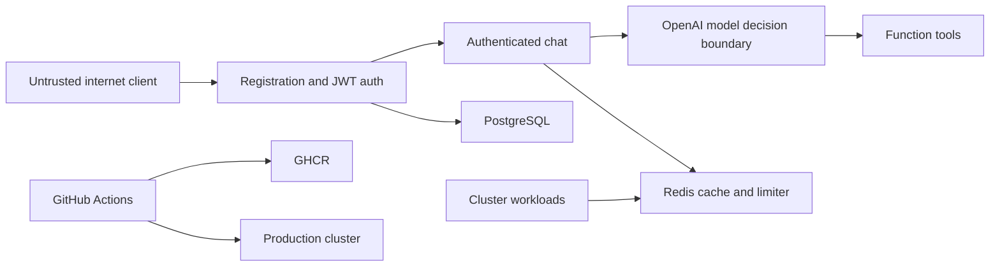

# Security

## Security scope

This service exposes registration, JWT login, authenticated streaming chat, health checks, and
Prometheus metrics. Chat prompts reach an OpenAI model, specialist handoffs, and static read-only
tools. PostgreSQL stores users and password hashes. Redis stores short-lived responses and
distributed rate-limit counters.

The current mock tools perform no infrastructure mutation. That fact materially limits current tool
misuse impact; it must not be assumed after real clients are introduced.

## Implemented controls

- Argon2 password hashing through `pwdlib`.
- Expiring JWTs with an algorithm allowlist and active-user database lookup.
- Request validation for email, password length, and prompt length.
- Per-IP registration/login and per-user chat limits through Redis.
- Versioned, model-aware, user-isolated response-cache keys.
- Six-turn and 90-second agent execution bounds.
- Input and specialist output guardrails.
- Generic client-facing provider errors.
- No raw tool arguments or outputs in SSE progress events.
- Production JWT key presence/length checks.
- Non-root hardened API pod configuration.
- Placeholder-only `.env.example` and Kubernetes Secret example.
- Git/Docker exclusions for local environments, secret files, kubeconfigs, keys, certificates,
  databases, logs, caches, outputs, and external-drive metadata.

## Secret handling

Never commit or place in Docker build context:

- `OPENAI_API_KEY`
- JWT signing secrets
- PostgreSQL or Redis production credentials
- Kubeconfigs
- Private keys or certificate bundles
- Access/refresh tokens
- Populated Kubernetes Secrets
- Database dumps or application logs

Use:

```bash
cp .env.example .env
```

for local Compose configuration. `.env` is ignored. The checked-in
`k8s/secret.example.yaml` must remain placeholder-only and must never be edited with real values.
For local manifest testing, create ignored `k8s/secret.local.yaml`. For production, use an external
secret manager, workload identity, External Secrets, or Sealed Secrets according to organizational
policy.

## Pre-commit scan result

The repository was reviewed before Git initialization using filename checks, high-confidence token/
key patterns, and a source-backed security audit.

No real OpenAI key, API token, JWT, private key, certificate key, kubeconfig, non-example `.env`, log,
database dump, or backup was found. Credential-like values that remain are recognizable placeholders,
GitHub secret references, or local development database defaults.

Generated artifacts found during preparation included a copied virtual environment, Python bytecode,
pytest/Ruff caches, empty working directories, and external-drive AppleDouble metadata. These are
excluded and removed from the Git repository.

## Threat boundaries



Security policy must be enforced at each boundary. Prompts and model decisions are untrusted input to
tools. Cluster-network location alone is not authentication. CI dependencies execute with the
permissions of their jobs.

## Known unresolved security risks

The highest priorities are:

- Tool authorization and tenant/role/resource enforcement before adding real integrations.
- Aggregate AI cost limits that cannot be multiplied through self-registration.
- Prompt-injection-resistant routing and argument policy.
- Fail-open limiter behavior during Redis outages.
- Redis ACL/TLS and NetworkPolicy.
- Trusted-proxy configuration for IP-based limits.
- Email ownership verification.
- External secret management and strict placeholder rejection.
- Pre-release validation if output guardrails must prevent disclosure.
- Monitoring endpoint access controls and immutable CI dependencies.

See [Production Risks](PRODUCTION_RISKS.md) for impact, state, and remediation.

## Introducing real tools

Before a mock tool is replaced:

1. Pass a typed authenticated context into the agent run.
2. Resolve tenant, roles, and allowed resource scopes outside the model.
3. Enforce authorization again inside the tool.
4. Separate read and write capabilities.
5. Require explicit approval for side effects.
6. Validate and bound every model-generated argument.
7. Use least-privilege workload identity rather than shared static credentials.
8. Persist a sanitized audit event for request, policy, approval, tool, resource, and outcome.
9. Add negative tests proving cross-tenant, out-of-scope, and unapproved operations fail.

## Reporting a vulnerability

This repository is private. Report suspected vulnerabilities privately to the repository owner. Do
not open a public issue containing credentials, exploit details, customer data, or infrastructure
identifiers. Revoke exposed credentials before beginning code remediation.
